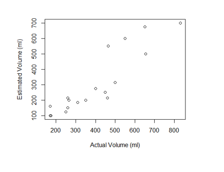
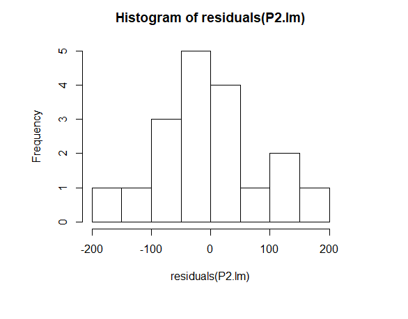
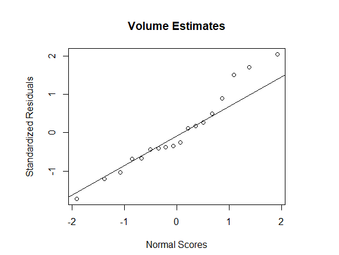

# Overview

TODO

# Methods
## Data Gathering
I had my husband guess the volumes of different containers I found in our kitchen cabinets. First I showed him our 250ml measuring cup to calibrate his guesses. Then I let him look at and hold each container, never having more than one container in his view at a time. My response variable is his guesses in ml: {315, 700, 100, 200, 275, 150, 215, 600, 125, 200, 185, 160, 550, 675, 500, 250, 100, 215}

Then I measured how much water could fit in each container using a 250ml measuring cup. The predictor variable are the actual volumes in ml: {500, 830, 175, 350, 400, 260, 260, 550, 250, 265, 310, 170, 465, 650, 655, 450, 170, 460}

***Bivariate data: {(500, 315), (830, 700), (175, 100), (350, 200) (400, 275) (260, 150), (260, 215), (550, 600), (250, 125), (265, 200), (310, 185), (170, 160), (465, 550), (650, 675), (655, 500), (450, 250), (170, 100), (460, 215)}***

##  Model Assumptions
### Scatterplot without Least Squares regression line


> Construct a scatterplot of the data without the least squares regression line.  Does the data appear to satisfy the criterion for a linear regression?

There appears to be a linear relationship between the x's and y's. The variance might be increasing slightly as the x values get larger -- but maybe not enough to be a problem.

> Comment on the model assumption that the observations of the response variable are  collected  independently.   Is  this  model  assumption  valid?   Is  there  any  part  of your data collection process that is intended to safeguard this assumption?

I believe the response variable was collected independently from each other. I made sure that I did not give my husband the containers in any particular size order, and I also made sure that there was never more than one container in his view at the same time.

### Residuals


> Construct a histogram of the residual values associated with the simple linear regression model and construct a normal probability plot of the residual errors.  Based on these  diagnostic  plots,  does  it  appear  that  the  normality  assumption  for  the  error term in the model is satisfied?

Yes, I would say the residuals are roughly linear. The histogram has a rough bell shape and the normal probability plot is pretty linear as well.

> Plot the residual values associated with the simple linear regression model as a function  of  the  predictor  variable.   Based  on  this  plots,  does  it  appear  that  constant variance assumption associate with the model is satisfied?
[Figure 1.4](pics/figure1.4.png)

It's hard to tell, but I don't think the constant variance assumption is satisfied. Like I mentioned above, it seems like the variance is increasing as x increases. The residuals are closer to 0 on the left side of the graph than the middle and right side of the graph. 

## Inferential Methods

> Using a null hypothesis that the subject making estimates is ‘on target’ in the sense that the μ(y·x)=x.  Determine if there is significant evidence at the α=.10 level that the slope of the true regression line relating the estimated values to the actualvalues is not ‘on target.’ Execute this hypothesis test using statistical software.

Using a null hypothesis that the subject making estimates is ‘on target’ in the sense that the μ(y·x)=x.  Determine if there is significant evidence at the α=.10 level that the slope of the true regression line relating the estimated values to the actualvalues is not ‘on target.’ Execute this hypothesis test using statistical software.

```
beta10<-1
P2adj.lm <- lm(EstVol~ActVol,offset= beta10*ActVol)
summary(P2adj.lm)

T-value: -0.268
P-value: 0.792
```
Do not reject; there is not significant evidence to believe that my subject is not 'on target.' 

>  Calculate ˆσ2 from your data set using statistical software and verify that it is equal to SSE/(n−2)

```
ˆσ2 = sigma(P2.lm)^2 = 8194.771
SSE/(n-2) = 131116.3/(18-2) = 8194.77
```

> Calculate a 99% confidence interval for β1

```
.9686 +/- (2.9208)*(0.1167)
= (.6278, 1.3095)
```

> Calculate a 99% confidence interval for β0

```
-79.4693 +/- (2.9208)*(51.1334)
= (-228.82, 69.88)
```

> Specify an object not used in the original sample and calculate x∗ (the actual measurement) for that object.  Calculate a 99% confidence interval for μY·x∗.

```
X∗ = 725

-79.47 + .97(725) +/- (2.92)*(26.61)
= (564.1, 701.5)
```

> Choose a value of your predictor variable that was not used in your actual sample, call this x∗.  Construct the estimated response value ˆy associated with this predictor variable; that is, estimate μY·x∗.

```
X∗ = 725
ˆy = .97(725) -79.47 = 623.78
```

> Compute  ˆρ from your data set.

```
ˆρ = +/-sqrt(r^2) = .9009
```

# Results

TODO